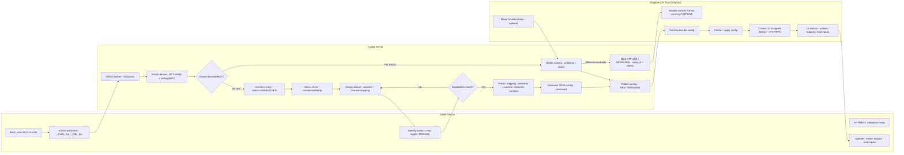
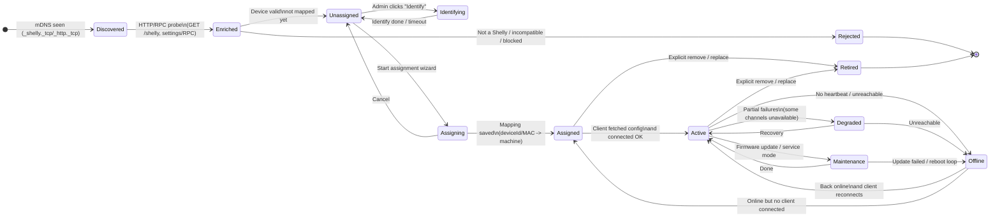

Workflow für

```mermaid
flowchart LR
%% ========== Lanes ==========
subgraph D["Shelly Device"]
D1[Boot / joins Wi-Fi or LAN]
D2["mDNS announce - _shelly._tcp / _http._tcp"]
D3[HTTP/RPC endpoints ready]
D4["Identify action - relay toggle / LED blink"]
D5["Operate - switch outputs / read inputs"]
end

subgraph S["Config Server"]
S1["mDNS listener - Discovery"]
S2["Enrich device - GET /shelly + settings/RPC"]
S3{Known deviceId/MAC?}
S4["Inventory entry - status=UNASSIGNED"]
S5["Admin UI list - name/model/id/ip"]
S6["Assign wizard - machine + channel mapping"]
S7{Capabilities match?}
S8["Persist mapping - deviceId->machine, channels->actions"]
S9["Generate JSON config - versioned"]
S10["Publish config - REST/WebSocket"]
S11["Health monitor - poll/ping + status"]
S12["Mark OFFLINE / DEGRADED - notify UI + clients"]
end

subgraph P["Raspberry Pi Touch Client(s)"]
P1[Fetch/subscribe config]
P2[Cache + apply config]
P3["Connect to assigned Shellys - HTTP/RPC"]
P4["UI actions - unlock / outputs / read inputs"]
P5["Report events/status - optional"]
P6["Disable controls / show warning if OFFLINE"]
end

%% ========== Flow ==========
D1 --> D2 --> S1 --> S2 --> S3
S3 -->|No new| S4 --> S5 --> S6 --> D4 --> S7
S7 -->|No| S6
S7 -->|Yes| S8 --> S9 --> S10 --> P1 --> P2 --> P3 --> P4 --> D5

%% Known devices go straight to monitoring + config distribution
S3 -->|Yes known| S11 --> S10

%% Runtime monitoring + failure path
P5 --> S11
S11 -->|offline/unreachable| S12 --> P6
```

```mermaid
stateDiagram-v2
  direction LR

  [*] --> Discovered: mDNS seen (_shelly._tcp/_http._tcp)

  Discovered --> Enriched: HTTP/RPC probe\n(GET /shelly, settings/RPC)
  Enriched --> Rejected: Not a Shelly / incompatible / blocked
  Rejected --> [*]

  Enriched --> Unassigned: Device valid\nnot mapped yet
  Unassigned --> Identifying: Admin clicks "Identify"
  Identifying --> Unassigned: Identify done / timeout

  Unassigned --> Assigning: Start assignment wizard
  Assigning --> Unassigned: Cancel
  Assigning --> Assigned: Mapping saved\n(deviceId/MAC -> machine)

  Assigned --> Active: Client fetched config\nand connected OK
  Active --> Degraded: Partial failures\n(some channels unavailable)
  Degraded --> Active: Recovery

  Active --> Offline: No heartbeat / unreachable
  Degraded --> Offline: Unreachable
  Offline --> Active: Back online\nand client reconnects
  Offline --> Assigned: Online but no client connected

  Assigned --> Retired: Explicit remove / replace
  Active --> Retired: Explicit remove / replace
  Retired --> [*]

  %% Optional maintenance path
  Active --> Maintenance: Firmware update / service mode
  Maintenance --> Active: Done
  Maintenance --> Offline: Update failed / reboot loop
```
