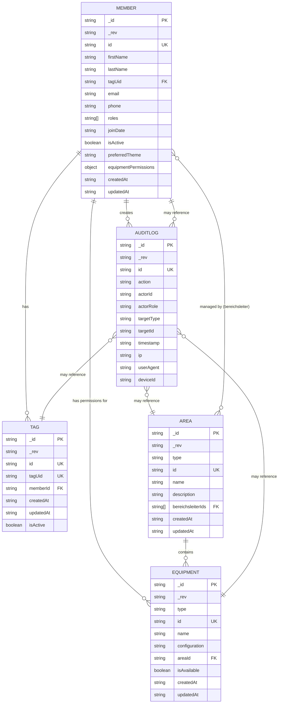

# MKS Control Database Diagram

This diagram represents the CouchDB database structure for the MKS Control system.

## Database Structure Overview

### Collections

The system uses three main CouchDB databases:

1. **mks_members** - Stores members, equipment, and areas
2. **mks_tags** - Stores RFID tag mappings
3. **mks_audit** - Stores audit logs for user actions and system changes

### Entities

#### Member

- Primary user entity in the system
- Contains personal information (name, email, phone)
- Manages roles and permissions
- Links to RFID tags via `tagUid`
- Has equipment-specific permissions stored in `equipmentPermissions` object
- Theme preference for UI customization
- Tracks creation and last update timestamps

#### Tag

- Represents RFID tags assigned to members
- Links to members via `memberId`
- Can be active or inactive
- Unique constraint on `tagUid`
- Tracks creation and last update timestamps

#### Equipment

- Represents machines and tools in the makerspace
- Can be assigned to an area via `areaId`
- Has availability status
- Optional configuration data
- Tracks creation and last update timestamps

#### Area

- Represents physical or logical areas in the makerspace
- Contains equipment
- Has area managers (Bereichsleiter) via `bereichsleiterIds` array

#### AuditLog

- Records all user actions and system changes for security and compliance
- Captures who performed an action (`actorId`, `actorRole`), what action was performed (`action`), and what entity was affected (`targetType`, `targetId`)
- Includes network metadata: `ip`, `userAgent`, `deviceId` for additional security context
- All timestamps are in ISO 8601 format
- Actions include:
  - **Authentication**: `auth.login`, `auth.login.invalid`, `auth.login.inactive`, `auth.login.admin-tag`, `auth.logout`
  - **Member Management**: `member.create`, `member.update`, `member.roles.update`, `member.activate`, `member.deactivate`, `member.permissions.update`
  - **Area Management**: `area.create`, `area.update`, `area.delete`
  - **Equipment Management**: `equipment.create`, `equipment.update`, `equipment.delete`
  - **Tag Management**: `tag.add`, `tag.remove`
- Automatic retention policy: Logs older than 1 year (365 days) are purged automatically via scheduled cleanup
- Indexes: `timestamp`, `action`, `actorId`, `targetId` for efficient querying and filtering

### Relationships

- **Member ↔ Tag**: One member can have multiple tags (one-to-many)
- **Member ↔ Equipment**: Members have permission records for equipment (many-to-many via equipmentPermissions object)
- **Area ↔ Equipment**: One area contains multiple equipment items (one-to-many)
- **Area ↔ Member**: Areas have multiple managers (Bereichsleiter), members can manage multiple areas (many-to-many)

### Indexes

#### mks_members database:

- `tagUid` - Fast lookup of members by RFID tag
- `isActive` - Filter active/inactive members

#### mks_tags database:

- `tagUid` - Fast lookup of tags by UID
- `memberId` - Find all tags for a specific member

#### mks_audit database:

- `timestamp` - Query logs by creation time
- `action` - Filter audit logs by action type
- `actorId` - Find all actions performed by a specific user
- `targetId` - Find all actions affecting a specific entity

### Audit Logging Configuration

**Environment Variables:**

- `AUDIT_RETENTION_DAYS` (default: 365) - Number of days to retain audit logs before automatic purge
- `AUDIT_CLEANUP_INTERVAL_MS` (default: 86400000 / 24 hours) - How frequently to run the audit retention cleanup job

**Retention Policy:**

The system automatically purges audit logs older than the configured retention period. The cleanup job runs at the specified interval in the background without blocking request processing. This ensures the audit database remains manageable while maintaining compliance with retention requirements.
