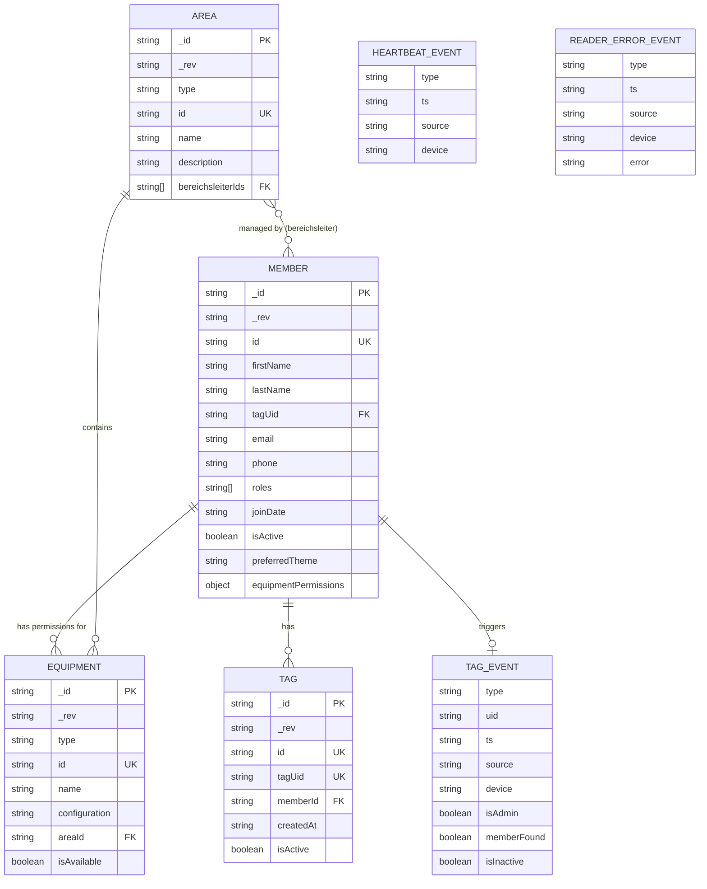

# MKS Control Database Diagram

This diagram represents the CouchDB database structure for the MKS Control system.

## Database Structure Overview

### Collections

The system uses two main CouchDB databases:

1. **mks_members** - Stores members, equipment, and areas
2. **mks_tags** - Stores RFID tag mappings

### Entities

#### Member

- Primary user entity in the system
- Contains personal information (name, email, phone)
- Manages roles and permissions
- Links to RFID tags via `tagUid`
- Has equipment-specific permissions stored in `equipmentPermissions` object
- Theme preference for UI customization

#### Tag

- Represents RFID tags assigned to members
- Links to members via `memberId`
- Can be active or inactive
- Unique constraint on `tagUid`

#### Equipment

- Represents machines and tools in the makerspace
- Can be assigned to an area via `areaId`
- Has availability status
- Optional configuration data

#### Area

- Represents physical or logical areas in the makerspace
- Contains equipment
- Has area managers (Bereichsleiter) via `bereichsleiterIds` array

#### Auth Events

Real-time authentication events (not stored in database, used for WebSocket communication):

- **TagEvent** - RFID tag scanned
- **HeartbeatEvent** - Reader status update
- **ReaderErrorEvent** - Reader error notification

### Relationships

- **Member ↔ Tag**: One member can have multiple tags (one-to-many)
- **Member ↔ Equipment**: Members have permission records for equipment (many-to-many via equipmentPermissions object)
- **Area ↔ Equipment**: One area contains multiple equipment items (one-to-many)
- **Area ↔ Member**: Areas have multiple managers (Bereichsleiter), members can manage multiple areas (many-to-many)

### Indexes

#### mks_members database:

- `tagUid` - Fast lookup of members by RFID tag
- `isActive` - Filter active/inactive members

#### mks_tags database:

- `tagUid` - Fast lookup of tags by UID
- `memberId` - Find all tags for a specific member
